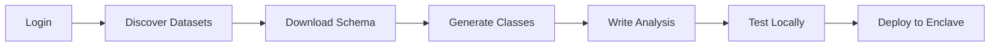

# Epsilon Research Template 🔬

[](https://github.com/Epsilon-Data/epsilon-research-template/generate)

A ready-to-use template for privacy-preserving data research with the Epsilon SDK. Start analyzing sensitive datasets with automatic Python class generation and differential privacy protection.

## 🚀 Quick Start

1. **Click "Use this template"** above to create your research project
2. **Install the Epsilon SDK**:
   ```bash
   pip install -r requirements.txt
   ```
3. **Start researching**:
   ```bash
   # Login to Epsilon platform
   epsilon login
   
   # See available datasets
   epsilon datasets
   
   # Download healthcare dataset example
   epsilon archetypes healthcare_db
   epsilon compile archetypes/healthcare_db/healthcare_db.json
   
   # Run example analysis
   python example_analysis.py
   ```

🎉 **You're ready to start your research!**

## 📊 What You Get

This template provides everything you need for privacy-preserving research:

### ✅ Pre-configured Environment
- Epsilon SDK installed and ready
- Example analysis scripts
- Proper .gitignore for research projects

### ✅ Working Examples
- Healthcare data analysis
- Generated Python classes for easy data access
- Privacy-preserving analytics patterns
- Deployment-ready analysis packages

### ✅ Research Workflow


## 🔬 Research Examples

### Basic Data Exploration
```python
from archetypes.healthcare_db.healthcare_db import create_dataset

# Load your dataset
dataset = create_dataset()
print(f"Dataset size: {len(dataset)} records")

# Access data with simple dot notation
for patient in dataset:
    print(f"Patient {patient.patient.patient_id}: {patient.patient.diagnosis}")
    
    # Access nested data easily
    if patient.patient.vitals.stable:
        print(f"Heart rate: {patient.patient.vitals.heart_rate} BPM")
```

## 📁 Project Structure

```
your-research-project/
├── README.md                    # This file
├── example_analysis.py          # Working example to start from
├── archetypes/                  # Downloaded datasets (auto-generated)
│   └── healthcare_db/
│       ├── healthcare_db.json   # Dataset schema
│       ├── healthcare_db.py     # Generated Python classes
│       └── healthcare_db_dummy.csv # Sample data
├── build/                       # Analysis packages (auto-generated)
```

## 🛠️ Available Commands

```bash
# Authentication
epsilon login                    # Login to Epsilon platform
epsilon status                   # Check auth status

# Dataset Discovery
epsilon datasets                 # List available datasets

# Schema & Code Generation  
epsilon archetypes <dataset_id>  # Download dataset schema + sample data
epsilon compile <json_file>      # Generate Python classes

# Analysis Development
python example_analysis.py       # Run example analysis

# Deployment
epsilon build <script.py>        # Build analysis package for deployment
```

## 🔍 Research Workflow Guide

### 1. Discover Your Data
```bash
epsilon login
epsilon datasets
```
Browse available datasets and find ones relevant to your research.

### 2. Get the Data Schema
```bash
epsilon archetypes customer_db
```
This downloads:
- JSON schema describing the data structure
- Sample CSV data for development
- Documentation about the dataset

### 3. Generate Python Classes
```bash
epsilon compile archetypes/customer_db/customer_db.json
```
Creates Python classes with:
- Simple dot notation access (`record.customer.age`)
- Type safety and IDE autocompletion
- Handles both JSON and CSV data formats

### 4. Develop Your Analysis
Start with `example_analysis.py` or create new scripts:
- Test with sample data locally
- Use generated classes for easy data access
- Apply your research methods

### 5. Deploy for Real Data
```bash
epsilon build example_analysis.py
```
Creates a deployment package that:
- Runs in secure enclaves with real data
- Applies differential privacy protection
- Returns research results safely

## 🆘 Need Help?

### Quick Fixes
- **Import errors**: Run `epsilon archetypes <dataset>` and `epsilon compile <json>`
- **Auth issues**: Run `epsilon login` and `epsilon status`
- **No data**: Check that CSV files exist in `archetypes/` folders

